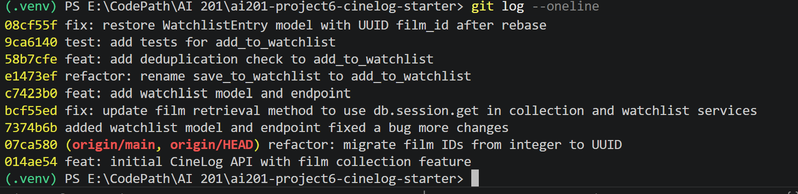

# PR Response Doc — CineLog Watchlist Feature

## AI Usage
## AI Usage
For this project, I used AI to help understand the codebase before
making any changes. I described my reading of the code and asked whether
my understanding of the flow was correct, then asked follow-up questions
to confirm I understood how functions like `add_to_collection()` and the
test fixtures worked before writing my own versions.

For Comments 4 (default visibility) and 5 (sort order), I wrote my position first, then used AI to
stress-test my arguments, asking what counterarguments a reviewer might
raise. My final responses was built on that process: for Comment 4, I
strengthened the community-sharing rationale and added a concrete
mitigation for the privacy tradeoff; for Comment 5, I shifted from a
weaker argument to one grounded in long-term list navigability and user
behavior around watched films.

## Comment 1 — Rename
**What I did:**
Renamed `save_to_watchlist()` to `add_to_watchlist()` in
`services/watchlist_service.py` and updated the one call site in
`routes/watchlist/watchlist.py` (the import line and the call inside
`add_film()`). Also updated the docstring first line to match.
The rename follows the project's `verb_to_noun` naming convention
already established by `add_to_collection()` in `collection_service.py`.

**How I verified:**
Searched the entire codebase for `save_to_watchlist` — found exactly
two references (the definition and the call site), both updated.
No other files imported or called the old name.

## Comment 2 — Deduplication
**What I did:**
Added an `AlreadyInWatchlistError` exception class to
`watchlist_service.py` and a deduplication guard inside
`add_to_watchlist()`, between the film-exists check and the entry
creation. The guard queries for an existing `WatchlistEntry` with the
same `(user_id, film_id)` pair and raises `AlreadyInWatchlistError`
if one is found.

Defined the exception in `watchlist_service.py` directly rather than
in `collection_service.py` — it belongs to the watchlist feature, not
the collection feature.

**How I verified:**
Followed the same pattern as `add_to_collection()` in
`collection_service.py` step for step: film check first, dedup check
second, create only if both pass. The dedup test
`test_add_to_watchlist_duplicate_raises` confirms the guard fires and
no duplicate row is created.

## Comment 3 — Missing test
**What I did:**
Created `tests/test_watchlist.py` with three tests:
- `test_add_to_watchlist_creates_entry` — happy path, verifies the entry
  is returned and persisted in the DB
- `test_add_to_watchlist_duplicate_raises` — verifies `AlreadyInWatchlistError`
  fires on a duplicate add and that only one row exists after
- `test_add_to_watchlist_nonexistent_film_raises` — verifies
  `FilmNotFoundError` fires when the film_id doesn't exist in the DB

**How I verified:**
Modeled each test directly on its equivalent in `test_collection.py`.
Removed the sort order test for now since `get_watchlist()` sorts
alphabetically by title, not by date — that behavior is under discussion
in Comment 5. Ran `pytest tests/test_watchlist.py -v` to confirm all
three pass.

## Comment 4 — Default visibility
**My position:**
Keep `public=True` as the default.

**Reasoning:**
The public default supports CineLog's community value of sharing, as it
allows users to see what films others have on their watchlist, which
encourages discovery. Keeping it public by default lowers the barrier
to that shared experience without requiring users to actively opt in.

**Tradeoff acknowledged:**
Some users may prefer privacy for films covering sensitive topics. This
could be mitigated by an opt-out feature at the individual film level,
allowing users to mark specific titles as private while keeping the
default public.

## Comment 5 — Sort order
**My position:**
Keep the current alphabetical sort order.

**Reasoning:**
As a watchlist grows, date-added order buries older films at the bottom,
making it harder to find a specific title by name. If users aren't
consistently removing films after watching them, the list becomes
cluttered and date-added order compounds that problem making it difficult to search for films. 
Therefore, alphabetical order stays stable and scannable regardless of list size.

**Engagement with reviewer's point:**
The reviewer's preference for date-added is valid — it surfaces recently
added films immediately. However, alphabetical order serves long-term
usability better as the list grows. A possible tradeoff would be an
auto-remove feature that removes films from the watchlist once watched
— which would make date-added order more practical and address the
reviewer's preference directly.

## Comment 6 — Rebase
**What conflicted:**
The refactor on `main` migrated `Film.id` from `db.Integer` to
`db.String(36)` (UUID). My branch still had `WatchlistEntry.film_id`
typed as `db.Integer`. Additionally, because `WatchlistEntry` didn't
exist on `main`, Git took `main`'s version of `models.py` wholesale
during the rebase, dropping `WatchlistEntry` entirely.

**How I resolved it:**
Ran `git rebase origin/main`. After the rebase completed, confirmed
`models.py` was missing `WatchlistEntry`. Manually restored the class
with `film_id` typed as `db.String(36)` to match the UUID refactor.
Also updated the `film_id` docstring in `watchlist_service.py` from
`(int)` to `(str): UUID of the film.`

**How I verified no conflict remains:**
Ran `git show HEAD:models.py` to confirm `WatchlistEntry` was restored
with `film_id = db.Column(db.String(36), ...)`. Ran `git log --oneline`
to confirm linear history with no merge commits. The refactor commit
`07ca580` appears in the branch history below my commits.

---

# Stretch Features

## Stretch Feature — remove_from_watchlist()
**What I did:**
Added `NotInWatchlistError` exception class and `remove_from_watchlist(user_id, film_id)`
to `watchlist_service.py`, following the same pattern as
`remove_from_collection()` in `collection_service.py`. The function
queries for the entry, raises `NotInWatchlistError` if not found,
otherwise deletes it and returns `True`.

Added two tests to `test_watchlist.py`:
- `test_remove_from_watchlist_removes_entry` — happy path, verifies
  the entry is deleted and DB confirms it's gone
- `test_remove_from_watchlist_not_in_watchlist_raises` — verifies
  `NotInWatchlistError` fires when the film isn't on the watchlist

## Stretch Feature — Second Test
**What I tested:**
`test_get_watchlist_returns_correct_format` — verifies that
`get_watchlist()` returns a list of dicts, each containing the expected
keys (`title`, `date_added`, `public`).

**Why I chose this case:**
`get_watchlist()` merges two data sources — `film.to_dict()` and the
`WatchlistEntry` metadata — into a single dict per item. I wanted to
verify that the merged output has the correct structure and that the
format conversion from ORM objects to a list of dicts doesn't drop any
expected fields. This also caught a missing `film` relationship on
`WatchlistEntry` that would have caused a runtime error in production.

## Stretch Feature — Visibility Toggle
**What I added:**
Added an optional `public` parameter to `add_to_watchlist(user_id, film_id, public=True)`.
Callers can now set visibility explicitly when adding a film, overriding the default.
Updated the POST endpoint in `routes/watchlist/watchlist.py` to accept `public` in the
request body: `{ "film_id": "...", "public": false }`.

**Tests added:**
- `test_add_to_watchlist_with_public_false` — verifies explicit `public=False` is persisted
- `test_add_to_watchlist_defaults_to_public_true` — verifies default behavior when `public` is omitted

**Design rationale:**
Making `public` optional with a default preserves backward compatibility — existing code
that doesn't pass `public` continues to work. Callers who need privacy for specific films
can now opt out explicitly rather than opting into the feature wholesale.

---

## PR Description
This PR adds the watchlist feature to CineLog, allowing users to save
films they intend to watch later.

**What was added:**
- `WatchlistEntry` model with `public` visibility flag (default `True`)
- `add_to_watchlist()` service function with film-exists and dedup guards
- `get_watchlist()` service function returning enriched film dicts
- POST and GET endpoints under `/watchlist/<user_id>`
- Tests for happy path, duplicate, and nonexistent film cases

**Design decisions:**
- *Default visibility (`public=True`)*: Kept public by default to support
  CineLog's community value of sharing. Users can see each other's
  watchlist for film discovery. Privacy tradeoff is acknowledged and
  could be mitigated by a per-title opt-out feature.
- *Sort order (alphabetical)*: Kept alphabetical rather than switching to
  date-added. As a watchlist grows, alphabetical order stays stable and
  scannable. Date-added buries older films as new ones accumulate,
  making the list harder to navigate if users aren't consistently
  removing watched films.

**Manual testing steps:**

1. Clone the repo and install dependencies:
pip install -r requirements.txt

2. Run the app:
python app.py

3. Add a film to a user's watchlist (replace UUIDs with real values):
POST http://localhost:5000/watchlist/<user_id>/add
Body: { "film_id": "<film_uuid>" }
   Expected response: `201` with the new `WatchlistEntry` as JSON.

4. Try adding the same film again:
POST http://localhost:5000/watchlist/<user_id>/add
Body: { "film_id": "<same_film_uuid>" }
   Expected response: error — `AlreadyInWatchlistError`.

5. Try adding a film that doesn't exist:
POST http://localhost:5000/watchlist/<user_id>/add
Body: { "film_id": "00000000-0000-0000-0000-000000000000" }
   Expected response: error — `FilmNotFoundError`.

6. Retrieve the watchlist:
GET http://localhost:5000/watchlist/<user_id>
   Expected response: `200` with a list of film dicts sorted
   alphabetically by title, each including `date_added` and `public`.

## Git Log image
